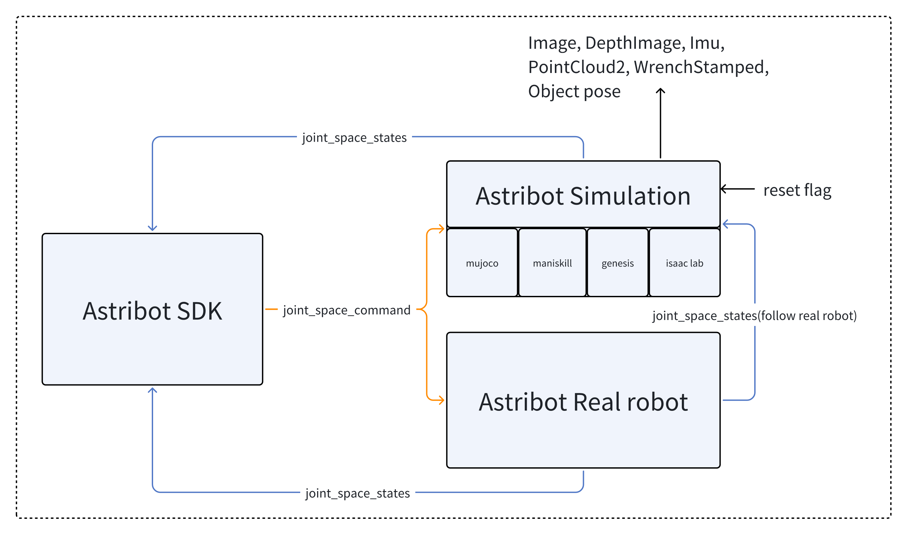

# 🚀 Astribot Simulation

**A unified robot simulation platform** built on top of **MuJoCo**, **Genesis**, **ManiSkill** and **IsaacLab**.  
This project provides a common abstraction layer so that you can run your robot across different simulators with a consistent API.  
It is designed as a **research tool** for users of Astribot.

<p align="center">
  
</p>

---

## 🎥 Demo

<p align="center">
  
</p>

---

## 📌 Features

- 🔄 **Multi-backend environments**: Switch between **MuJoCo**, **Genesis**, **ManiSkill**, and **IsaacLab** with one line of code.  
- ⚡ **ROS & ROS2 Integration**: Comprehensive support for both ROS1 and ROS2 interfaces to bridge simulation and real robots.  
- 🤖 **Plug-and-play robot models**: Full support for **URDF** and **MJCF** formats.  
- 🧩 **Config-driven setup**: Easily manage each simulator and robot variant via structured **YAML** configurations.  
- 🛠 **Research-friendly utilities**: Includes logging, common analysis tools, and a unified environment factory.  

---

## 🗺 Roadmap

- 🐳 **Dockerized deployment**: Pre-configured Docker images for easy environment setup and reproduction. *(Coming Soon)*  

---

## 📂 Project Structure

```
astribot_simulation/
│── astribot_envs/              # Environment wrappers for each simulator
│   ├── astribot_base_env.py
│   ├── astribot_mujoco_env.py
│   ├── astribot_genesis_env.py
│   ├── astribot_maniskill_env.py
│   ├── astribot_isaaclab_env.py
│   └── astribot_envs_factory.py
│
│── config/                     # YAML configs for different robots & simulators
│   └── astribot_s1/
│       ├── simulation_genesis_param_chassis_fixed.yaml
│       ├── simulation_maniskill_param_chassis_fixed.yaml
│       ├── simulation_mujoco_param_with_hand.yaml
│       └── ...
│
│── astribot_descriptions/                # Robot models
│   ├── urdf/
│   └── mjcf/
│
│── simu_utils/                 # Utility functions
│   ├── simu_common_tools.py
│   └── robot_ros_interface.py
│
│── tools/                      # Setup scripts
│   ├── install.sh
│   ├── Miniconda3-py38_4.9.2-Linux-x86_64.sh
│   ├── fix_GLIBCXX_3.4.30_bug.sh
│   └── fix_LIBFFI_BASE_7.0_bug.sh
│
│── astribot_simulation.py      # Main entry
│── env.sh                      # Environment setup
│── README.md
│── LICENSE
└── __init__.py
```

---

## 📦 Installation

You can install the simulation either inside a Docker container or directly on your host machine.

### Option 1: Docker Installation

```bash
# Enter the Ubuntu 22.04 Docker container
docker exec -it ****** /bin/bash

# Clone the repository
git clone -b develop https://gitlab.astribot.com/public_repo/astribot_simulation.git

# Navigate to the project directory
cd astribot_simulation

# Initialize and update all submodules recursively
git submodule update --init --recursive

# Batch pull LFS objects for all submodules
git submodule foreach git lfs pull

# Install all simulators (MuJoCo, Genesis, ManiSkill)
bash tools/install.sh
```

### Option 2: Host Machine Installation

```bash
# Clone the repository
git clone -b develop https://gitlab.astribot.com/public_repo/astribot_simulation.git

# Navigate to the project directory
cd astribot_simulation

# Initialize and update all submodules recursively
git submodule update --init --recursive

# Batch pull LFS objects for all submodules
git submodule foreach git lfs pull

# (Optional) Install Miniconda - only needed for Ubuntu 20.04 (ROS1)
bash tools/Miniconda3-py38_4.9.2-Linux-x86_64.sh

# Install dependencies
# Choose one of the following:

# Install only MuJoCo simulator
bash tools/install_mujoco.sh

# OR install all simulators (MuJoCo, Genesis, ManiSkill, IsaacLab)
bash tools/install.sh
```

---

## 🚀 Quick Start

### Launch Astribot Simulation:

```python
conda activate astribot_simu
source env.sh && python3 astribot_simulation.py
```

If you want to reset the robot state, press Backspace while the simulation is running.

### Switch to Other Simulators or Robots
You can switch to another simulator or robot by modifying the YAML file path in astribot_simulation.py:

```python
from astribot_envs.astribot_envs_factory import AstribotEnvsFactory

def main():
    # Load param from yaml, create a simulation env using the Factory Pattern
    astribot_yaml_file='config/astribot_s1/simulation_genesis_param.yaml'
    astribot_envs_factory = AstribotEnvsFactory()
    astribot_data = AstribotEnvsFactory.load_yaml_file(astribot_yaml_file)
    astribot_simulation_thread = astribot_envs_factory.create_simulation_env(astribot_data)

if __name__ == '__main__':
    main()
```
---

## 📄 YAML Configuration Files

The `config/astribot_s1/` folder contains several YAML files to customize your simulation environment. Each file defines a combination of **simulator backend**, **robot variant**, and **Hardware configuration**:

| YAML File | Description |
|-----------|-------------|
| `simulation_genesis_param_chassis_fixed.yaml` | Genesis backend with fixed chassis configuration. |
| `simulation_maniskill_param_chassis_fixed.yaml` | ManiSkill backend with fixed chassis configuration. |
| `simulation_mujoco_param_chassis_fixed.yaml` | MuJoCo backend with fixed chassis configuration. |
| `simulation_mujoco_param_with_camera.yaml` | MuJoCo backend with three-camera configuration. |
| `simulation_mujoco_param_with_hand.yaml` | MuJoCo backend with BrainCo hand configuration. |
| `simulation_mujoco_param.yaml` | MuJoCo backend with default configuration. |

💡 **Tip:**  
To switch simulators or robot setups, modify the `astribot_yaml_file` variable in `astribot_simulation.py` to point to the desired YAML file. No code change is needed beyond this.

---

## 💻 System Requirements

- **Operating System:** Ubuntu 20.04 LTS / Ubuntu 22.04 LTS  
- **Middleware:** ROS Noetic (for 20.04) / ROS2 Humble (for 22.04)  
- **Python Version:** Python == 3.10 (use Conda environment)  

| Hardware / Software | Recommended Specifications            |
| ------------------ | ----------------------------------- |
| CPU                | Intel i5-14600F or higher           |
| GPU                | NVIDIA RTX 2080 Ti or higher        |
| GPU Driver         | NVIDIA driver ≥ 535                 |
| CUDA               | CUDA ≥ 12.0                         |
| Python             | Python == 3.10 (Conda recommended)   |

> 📌 **Note:** For GPU-accelerated simulation, ensure the above hardware and driver requirements are met.  

---

## 🎮 Joint Space Command

If you want to directly control the joints, note: The robot exposes joint-space command topic (e.g., `/astribot_arm_left/joint_space_command`) for controlling the arm. The interpretation of the command depends on the control mode:

| Control Mode | Command Dimension | Meaning | Notes |
|--------------|-----------------|--------|-------|
| Position / Velocity Control | 7–14 | Values 7–14:<br>**First 7 values**: target joint **positions**<br>**Last 7 values**: target joint **velocities** | Includes **velocity compensation** and **gravity compensation** for smoother motion |
| Force Control | 7 | Each value represents the **torque/force** applied to the corresponding joint | ⚠️ *Note:* This mode does **not guarantee sim-to-real accuracy**, mainly for simulation purposes |

💡 **Tip:** 
If using **Astribot SDK**, you generally do **not** need to worry about these details — refer to the Astribot SDK documentation for more information. When using joint-space commands, ensure the control mode matches the command dimension to avoid unexpected behavior.

---

## 📷 Sensors

The robot supports cameras on hands and head. After loading the correct YAML configuration, you can receive image data on the corresponding ROS topics:

- **Raw color image**: `/astribot_whole_body/camera/<camera_name>/image_raw`  
- **Depth image**: `/astribot_whole_body/camera/<camera_name>/depth`  
- **Point cloud(in camera frame)**: `/astribot_whole_body/camera/<camera_name>/point_cloud`  

| Backend     | Supported Sensors |
|-------------|-------------------|
| **MuJoCo**   | RGB-D cameras and point clouds for both hands and the head. |
| **ManiSkill** | RGB cameras for both hands and the head. |
| **Genesis**   | Currently no sensor support. |

💡 **Tip**  
 - To enable sensors in **MuJoCo**, use: `simulation_mujoco_param_with_camera.yaml`  
 - To enable sensors in **ManiSkill**, use: `simulation_maniskill_param_chassis_fixed.yaml`

---

## 🛠 Tools

- `tools/install.sh` → environment setup  
- `tools/Miniconda3-py38_4.9.2-Linux-x86_64.sh` → install miniconda 
- `tools/fix_GLIBCXX_3.4.30_bug.sh` → patch for GLIBCXX bug  
- `tools/fix_LIBFFI_BASE_7.0_bug.sh` → patch for libffi bug  

---

## 📖 Documentation

- Environments: [`astribot_envs/`](astribot_envs/)  
- Config examples: [`config/astribot_s1/`](config/astribot_s1/)  
- Utilities: [`simu_utils/`](simu_utils/)  

---


## 📜 License

[BSD 3-Clause License](LICENSE)

---

## 🙌 Acknowledgements

Built on top of:  
- [MuJoCo](https://mujoco.org/)  
- [Genesis](https://genesis-world.readthedocs.io/en/latest/)  
- [ManiSkill](https://maniskill.ai/)  
