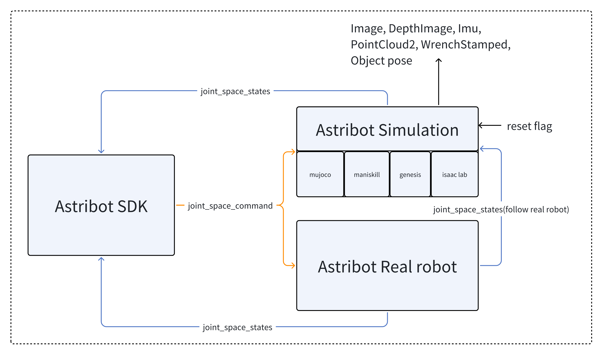
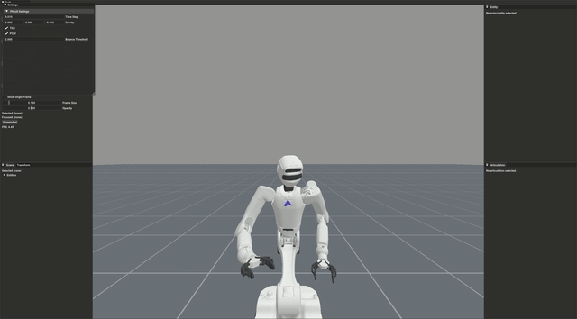
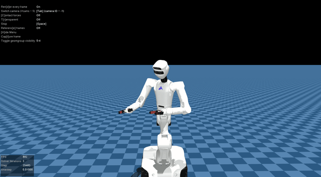
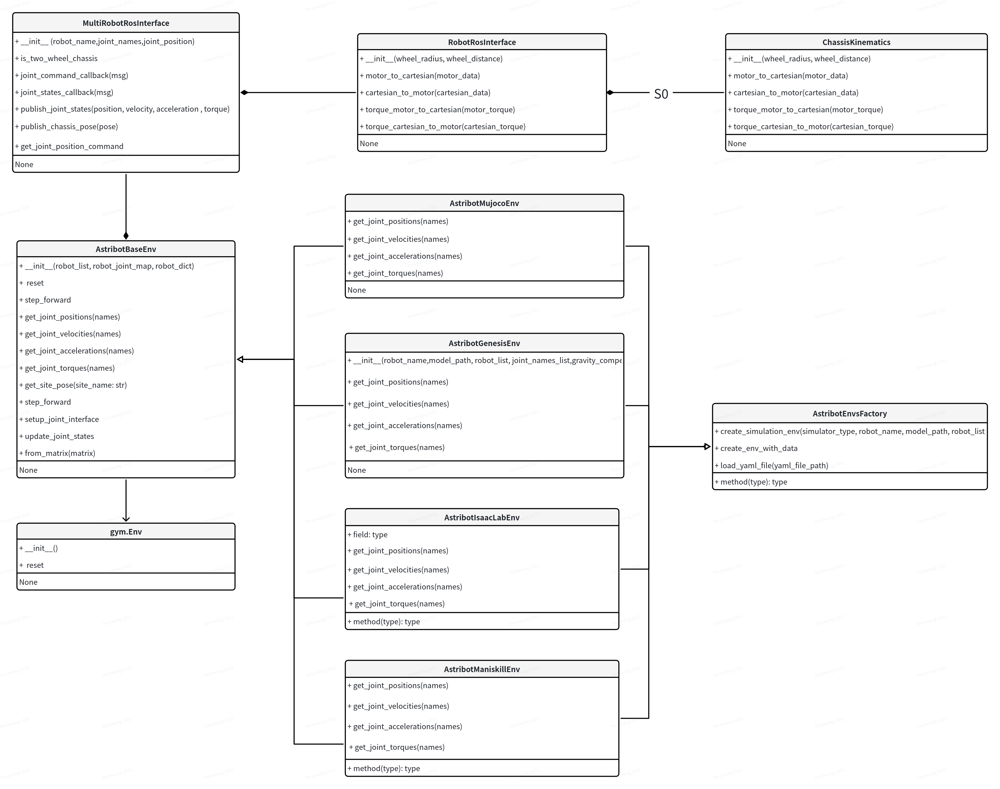

# Astribot Simulation

**A unified robot simulation platform** built on top of **MuJoCo**, **Genesis**, **ManiSkill** and **Isaac Lab**.
This project provides a common abstraction layer so that you can run your robot across different simulators with a consistent API.
It is designed as a **research tool** for users of Astribot.

<p align="center">
  
</p>

---

## Demo

<table align="center">
  <tr>
    <td align="center">
      <p><b>ManiSkill Environment</b></p>
      
    </td>
    <td align="center">
      <p><b>MuJoCo Simulation</b></p>
      
    </td>
  </tr>
</table>

---

## Features

- **Multi-backend environments**: Switch between **MuJoCo**, **Genesis**, **ManiSkill**, and **NVIDIA Isaac Lab** with one line of code.
- **ROS & ROS2 Integration**: Comprehensive support for both ROS1 and ROS2 interfaces to bridge simulation and real robots.
- **Plug-and-play robot models**: Full support for **URDF**, **MJCF** and **USD** formats.
- **Config-driven setup**: Easily manage each simulator and robot variant via structured **YAML** configurations.
- **Research-friendly utilities**: Includes logging, common analysis tools, and a unified environment factory.

---

## Project Structure

```
astribot_simulation/
├── astribot_simulation.py         # Main entry point
├── env.sh                         # Environment setup (sources ROS, sets ASTRIBOT_SIMU_ROOT)
├── pyproject.toml                 # Project metadata & version
├── requirements.txt               # Python dependencies
│
├── src/                           # Source code (src layout)
│   ├── version.py                 # Version string
│   ├── exceptions.py              # Custom exceptions
│   │
│   ├── astribot_envs/             # Environment wrappers for each simulator
│   │   ├── astribot_base_env.py       # Abstract base (extends gym.Env)
│   │   ├── astribot_mujoco_env.py     # MuJoCo backend
│   │   ├── astribot_genesis_env.py    # Genesis backend
│   │   ├── astribot_maniskill_env.py  # ManiSkill backend
│   │   ├── astribot_isaaclab_env.py   # Isaac Lab backend
│   │   └── astribot_envs_factory.py   # Factory: loads YAML, creates gym env
│   │
│   ├── simu_utils/                # Utility modules
│   │   ├── simu_common_tools.py       # Pose math, point cloud, logging
│   │   ├── robot_ros_interface.py     # ROS1/ROS2 publishers & subscribers
│   │   └── chassis_kinematics.py      # Omni-wheel kinematics
│   │
│   └── sim_assets_tools/          # Mesh & texture processing tools
│       ├── stl_to_dae.py, obj_to_dae.py, glb_to_dae.py
│       ├── add_logo_to_texture.py, add_logo_to_dae.py
│       ├── process_mujoco_xml.py, reduce_faces.py
│       └── lib/                       # Shared helpers for asset tools
│
├── config/                        # YAML configs for different robots & simulators
│   ├── astribot_s0/
│   ├── astribot_s1/
│   └── astribot_t1/
│
├── astribot_descriptions/         # Robot model files
│   ├── mjcf/                          # MuJoCo XML models (s0, s1, t1, worldbody)
│   ├── urdf/                          # URDF/SDF models (s0, s1, t1)
│   └── usd/                           # USD models (s1, for Isaac Lab)
│
├── astribot_msgs/                 # Custom ROS message/service/action definitions
│   ├── msg/                           # 22 message types
│   ├── srv/                           # 6 service types
│   ├── action/                        # 1 action type
│   ├── CMakeLists_ros1.txt / CMakeLists_ros2.txt
│   └── package_ros1.xml / package_ros2.xml
│
├── scripts/                       # Setup & build scripts
│   ├── install.sh                     # Full environment setup
│   ├── build.sh                       # Build astribot_msgs
│   ├── depends/                       # Miniconda installer
│   ├── lite_install/                  # MuJoCo-only installers
│   └── bugfix/                        # GLIBCXX / LIBFFI patches
│
├── tests/                         # Test suite
│   ├── unit/
│   └── integration/
│
└── docs/                          # Images and diagrams
```

---

## Installation

You can install the simulation either inside a Docker container or directly on your host machine.

### Option 1: Docker Installation

```bash
# Enter the Ubuntu 22.04 Docker container
docker exec -it <container_name> /bin/bash

# Clone the repository
git clone https://github.com/Astribot-Dev/astribot_simulation.git

# Navigate to the project directory
cd astribot_simulation

# Initialize and update all submodules recursively
git submodule update --init --recursive

# Batch pull LFS objects for all submodules
git submodule foreach git lfs pull

# Install all simulators (MuJoCo, Genesis, ManiSkill, IsaacLab)
bash scripts/install.sh
```

### Option 2: Host Machine Installation

```bash
# Clone the repository
git clone https://github.com/Astribot-Dev/astribot_simulation.git

# Navigate to the project directory
cd astribot_simulation

# Initialize and update all submodules recursively
git submodule update --init --recursive

# Batch pull LFS objects for all submodules
git submodule foreach git lfs pull

# (ROS1 only) Install Miniconda (Ubuntu 20.04)
bash scripts/depends/Miniconda3-py38_4.9.2-Linux-x86_64.sh

# Install dependencies
# Choose one of the following:

# Install only MuJoCo simulator
bash scripts/lite_install/install_mujoco.sh

# OR install all simulators (MuJoCo, Genesis, ManiSkill, IsaacLab)
bash scripts/install.sh
```

---

## Quick Start

### Launch Astribot Simulation:

```bash
conda activate astribot_simu
source env.sh && python3 astribot_simulation.py
```

If you want to reset the robot state, press Backspace while the simulation is running.

### Switch to Other Simulators

To switch simulators or robot setups, modify the YAML file path in `astribot_simulation.py` (line 16):

```python
from src.astribot_envs.astribot_envs_factory import AstribotEnvsFactory

def main(robot_type):
    # Load param from yaml, create a simulation env using the Factory Pattern
    astribot_yaml_file=f'config/astribot_{robot_type}/simulation_mujoco_param.yaml'
    astribot_envs_factory = AstribotEnvsFactory()
    astribot_data=AstribotEnvsFactory.load_yaml_file(astribot_yaml_file)
    _ = astribot_envs_factory.create_simulation_env(astribot_data)
```

---

## Architecture

To achieve high modularity and support multiple simulation backends, `astribot_simulation` is designed with a factory-pattern architecture.

### Class Diagram
<p align="center">
  
</p>

### Design Highlights
*   **Unified API**: All simulation environments (MuJoCo, Genesis, Isaac Lab, ManiSkill) inherit from `AstribotBaseEnv`, which is compatible with `gym.Env`.
*   **Factory Pattern**: Users can switch between different simulators by simply changing the `simulator_type` in the configuration via `AstribotEnvsFactory`.
*   **Sim-to-Real Bridge**: The `MultiRobotRosInterface` ensures that the internal simulation states are perfectly aligned with ROS messages, facilitating seamless deployment to real hardware.

---

## YAML Configuration Files

The `config/` folder contains YAML files for each robot variant (`astribot_s0`, `astribot_s1`, `astribot_t1`). Each file defines a combination of **simulator backend**, **robot variant**, and **hardware configuration**:

| YAML File (under `config/astribot_s1/`) | Description |
|-----------|-------------|
| `simulation_mujoco_param.yaml` | MuJoCo backend with default configuration. |
| `simulation_mujoco_param_chassis_fixed.yaml` | MuJoCo backend with fixed chassis. |
| `simulation_mujoco_param_with_camera.yaml` | MuJoCo backend with three-camera setup. |
| `simulation_mujoco_param_with_hand.yaml` | MuJoCo backend with BrainCo hand. |
| `simulation_genesis_param_chassis_fixed.yaml` | Genesis backend with fixed chassis. |
| `simulation_maniskill_param_chassis_fixed.yaml` | ManiSkill backend with fixed chassis. |
| `simulation_isaaclab_param.yaml` | Isaac Lab backend. |

**Tip:**
To switch simulators or robot setups, modify the `astribot_yaml_file` variable in `astribot_simulation.py` to point to the desired YAML file. No code change is needed beyond this.

---

## System Requirements

- **Operating System:** Ubuntu 20.04 LTS / Ubuntu 22.04 LTS
- **Middleware:** ROS Noetic (for 20.04) / ROS2 Humble (for 22.04)
- **Python Version:** Python == 3.10 (use Conda environment)

| Hardware / Software | Recommended Specifications            |
| ------------------ | ----------------------------------- |
| CPU                | Intel i5-14600F or higher           |
| GPU                | NVIDIA RTX 2080 Ti or higher        |
| GPU Driver         | NVIDIA driver >= 535                 |
| CUDA               | CUDA >= 12.0                         |
| Python             | Python == 3.10 (Conda recommended)   |

> **Note:** For GPU-accelerated simulation, ensure the above hardware and driver requirements are met.

---

## Joint Space Command

If you want to directly control the joints, note: The robot exposes joint-space command topic (e.g., `/astribot_arm_left/joint_space_command`) for controlling the arm. The interpretation of the command depends on the control mode:

| Control Mode | Command Dimension | Meaning | Notes |
|--------------|-----------------|--------|-------|
| Position / Velocity Control | 7-14 | Values 7-14:<br>**First 7 values**: target joint **positions**<br>**Last 7 values**: target joint **velocities** | Includes **velocity compensation** and **gravity compensation** for smoother motion |
| Force Control | 7 | Each value represents the **torque/force** applied to the corresponding joint | Note: This mode does **not guarantee sim-to-real accuracy**, mainly for simulation purposes |

**Tip:**
If using **Astribot SDK**, you generally do **not** need to worry about these details — refer to the Astribot SDK documentation for more information. When using joint-space commands, ensure the control mode matches the command dimension to avoid unexpected behavior.

---

## Sensors

The robot supports cameras on hands and head. After loading the correct YAML configuration, you can receive image data on the corresponding ROS topics:

- **Raw color image**: `/<robot_name>/camera/<camera_name>/image_raw`
- **Depth image**: `/<robot_name>/camera/<camera_name>/depth`
- **Point cloud (in camera frame)**: `/<robot_name>/camera/<camera_name>/point_cloud`

| Backend     | RGB | Depth | Point Cloud | Force/Torque | IMU |
|-------------|-----|-------|-------------|--------------|-----|
| **MuJoCo**   | Yes | Yes | Yes | Yes | Yes |
| **ManiSkill** | Yes | No | No | No | No |
| **Genesis**   | No | No | No | No | No |

**Tip:**
 - To enable sensors in **MuJoCo**, use: `simulation_mujoco_param_with_camera.yaml`
 - To enable sensors in **ManiSkill**, use: `simulation_maniskill_param_chassis_fixed.yaml`

---

## Scripts

| Script | Purpose |
|--------|---------|
| `scripts/install.sh` | Full environment setup |
| `scripts/build.sh` | Build `astribot_msgs` for ROS1 or ROS2 |
| `scripts/depends/Miniconda3-py38_4.9.2-Linux-x86_64.sh` | Install Miniconda |
| `scripts/lite_install/install_mujoco.sh` | MuJoCo-only install |
| `scripts/bugfix/fix_GLIBCXX_3.4.30_bug.sh` | Patch for GLIBCXX bug |
| `scripts/bugfix/fix_LIBFFI_BASE_7.0_bug.sh` | Patch for libffi bug |

---

## Documentation

- Environment wrappers: [`src/astribot_envs/`](src/astribot_envs/)
- Config examples: [`config/astribot_s1/`](config/astribot_s1/)
- Utilities: [`src/simu_utils/`](src/simu_utils/)

---

## Contributing

Contributions are welcome!
If you'd like to add support for new simulators or robots, please contact me at [tonywang@astribot.com].

---

## License

[BSD 3-Clause License](LICENSE)

---

## Acknowledgements

Built on top of:
- [MuJoCo](https://mujoco.org/)
- [Genesis](https://genesis-world.readthedocs.io/en/latest/)
- [ManiSkill](https://maniskill.ai/)
- [Isaac Lab](https://developer.nvidia.com/isaac/lab)
